# TP : Système de Gestion de Conférences & Keynotes (Microservices)

## 1. Contexte et Objectif
L'objectif de ce TP est de mettre en place une architecture **Microservices** complète basée sur l'écosystème **Spring Cloud**, avec un frontend **Angular** et une sécurisation via **Keycloak**.

L'application permet de gérer :
* Des **Keynotes** (Intervenants) : Informations personnelles, fonction, email.
* Des **Conférences** : Titre, type, date, durée, et association avec des Keynotes.
* Des **Reviews** : Avis laissés sur les conférences.

## 2. Architecture Technique

Le projet repose sur une architecture distribuée et centralisée.

### Diagramme d'Architecture
```mermaid
graph TD
    User((Utilisateur))
    Browser[Frontend Angular :4200]

    subgraph Infrastructure
        KC[Keycloak<br/>Identity Provider :8080]
        Disc[Discovery Service<br/>Eureka :8761]
        ConfSrv[Config Service<br/>:9999]
        Git[Git Config Repo]
    end

    subgraph Microservices
        GW[Gateway Service<br/>:8888]
        KS[Keynote Service<br/>:8081]
        CS[Conference Service<br/>:8082]
        DB1[(H2 DB Keynotes)]
        DB2[(H2 DB Conferences)]
    end

    User --> Browser
    Browser -->|OIDC Login| KC
    Browser -->|API + Bearer Token| GW

    GW -->|/api/keynotes| KS
    GW -->|/api/conferences| CS

    CS -->|Feign Client| KS

    KS --> DB1
    CS --> DB2

    GW -.->|Register| Disc
    KS -.->|Register| Disc
    CS -.->|Register| Disc

    GW -.->|Fetch Config| ConfSrv
    KS -.->|Fetch Config| ConfSrv
    CS -.->|Fetch Config| ConfSrv

    ConfSrv -.-> Git

````

### Stack Technologique

  * **Backend** : Java 21, Spring Boot 3.5.x
  * **Frontend** : Angular 20, Bootstrap 5
  * **Sécurité** : OAuth2, OIDC, Keycloak (Realm `sdia-real`)
  * **Base de données** : H2 (In-memory pour le développement)
  * **Orchestration & Communication** :
      * *Discovery* : Netflix Eureka
      * *Routing* : Spring Cloud Gateway
      * *Configuration* : Spring Cloud Config
      * *Inter-service* : OpenFeign

## 3\. Description des Services

| Service | Port | Description |
| :--- | :--- | :--- |
| **Config Service** | `9999` | Serveur de configuration centralisé. Récupère les configurations depuis un dépôt Git local ou distant. |
| **Discovery Service** | `8761` | Serveur Eureka (Service Registry). Permet aux microservices de s'enregistrer et de se découvrir dynamiquement. |
| **Gateway Service** | `8888` | Point d'entrée unique (API Gateway). Redirige les requêtes vers les services appropriés (`lb://KEYNOTE-SERVICE`, etc.) et gère le CORS. |
| **Keynote Service** | `8081` | Microservice fonctionnel. Gère le CRUD des intervenants (Speakers). Sécurisé (Resource Server). |
| **Conference Service**| `8082` | Microservice fonctionnel. Gère les conférences et les reviews. Utilise un **Client Feign** pour communiquer avec le Keynote Service. |
| **Frontend Angular** | `4200` | Interface utilisateur SPA. Intègre `keycloak-angular` pour la gestion de l'authentification et des rôles (`ADMIN`, `USER`). |

## 4\. Sécurité (Keycloak)

L'application délègue l'authentification à Keycloak.

  * **Realm** : `sdia-real`
  * **Client Frontend** : `conf-keynote-angular` (Public client).
  * **Rôles** : L'accès à certaines routes est conditionné par la possession du rôle `ADMIN` dans le token JWT.
  * **Intégration** : Le token JWT est automatiquement intercepté et ajouté dans le header `Authorization: Bearer ...` des requêtes HTTP sortantes d'Angular vers le Gateway.

## 5\. Mise en route

### Prérequis

  * Java 21 installé.
  * Node.js (v20+) et NPM.
  * Keycloak installé et démarré sur le port `8080`.

### Étapes de lancement

1.  **Démarrer Keycloak** :
      * Importer la configuration du realm ou créer manuellement le realm `sdia-real`.
      * Créer un utilisateur avec le rôle `ADMIN`.
2.  **Démarrer l'infrastructure Spring** (dans l'ordre) :
      * `config-service`
      * `discovery-service`
      * `keynote-service`
      * `conference-service`
      * `gateway-service`
3.  **Démarrer le Frontend** :
      * `cd frontend-angular`
      * `npm install`
      * `npm start`
4.  **Accès** : Ouvrir `http://localhost:4200`.

-----

## 6\. Captures d'écran et Fonctionnalités

### A. Infrastructure et Sécurité (Keycloak)

Cette section montre la configuration de l'Identity Provider nécessaire avant de lancer l'application.

| Description | Capture |
| :--- | :---: |
| **1. Démarrage de Keycloak**<br>Serveur lancé localement sur le port 8080. | 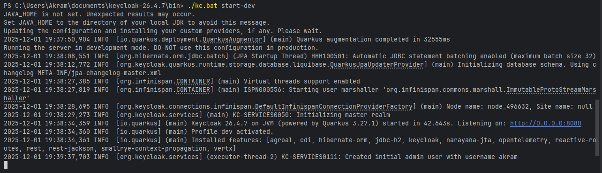 |
| **2. Création du Realm**<br>Configuration du realm `sdia-real` pour isoler les données de sécurité de l'application. | 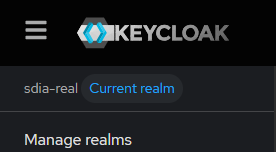 |
| **3. Gestion des Utilisateurs**<br>Création des comptes (ex: user1, admin) et assignation des rôles. |  |

### B. Tests Backend et API (Gateway & Postman)

Vérification du bon fonctionnement des microservices via le Gateway et Postman.

| Description | Capture |
| :--- | :---: |
| **4. Récupération Token OIDC**<br>Test du flux OAuth2 pour récupérer un Access Token valide. | 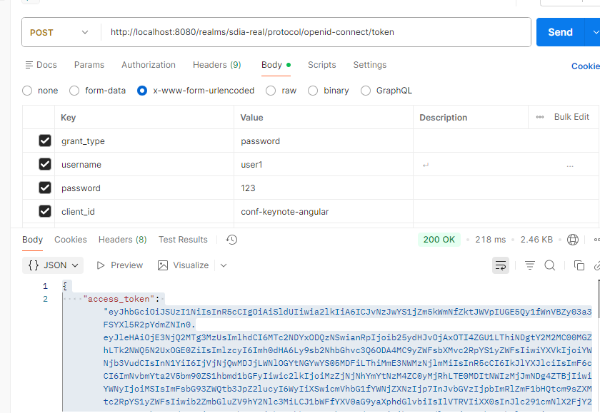 |
| **5. Test Route Keynotes via Gateway**<br>Appel GET sur `localhost:8888/keynote-service/api/keynotes`. | 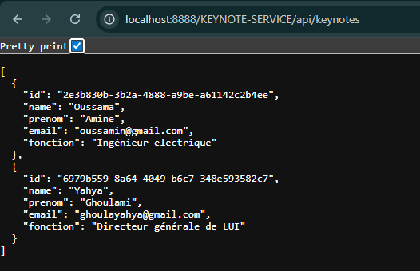 |
| **6. Appel Sécurisé avec Token**<br>Accès aux ressources protégées en passant le Bearer Token. | 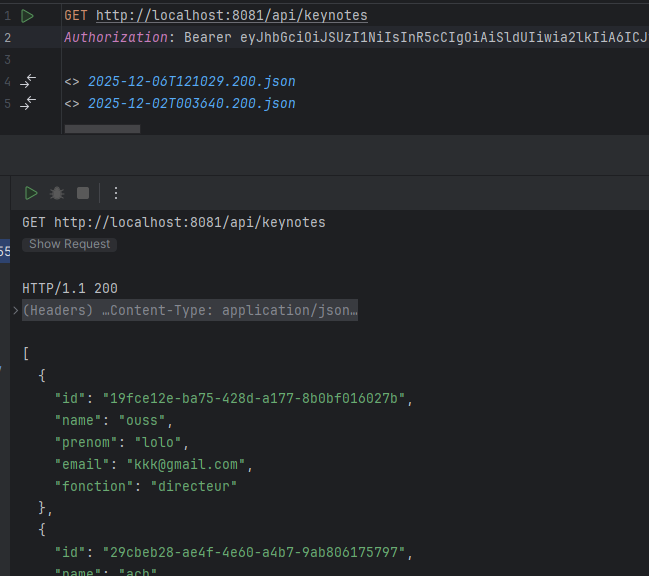 |
| **7. Test Route Conférences via Gateway**<br>Vérification du routage vers le service conférence. | 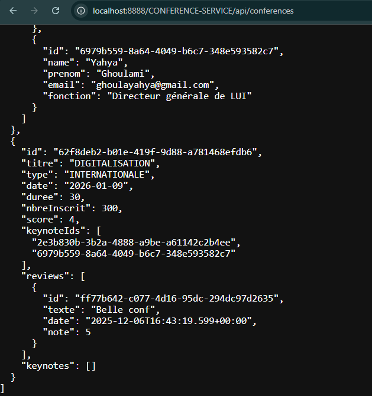 |
| **8. Persistance des Données (H2)**<br>Vue de la console H2 pour vérifier l'enregistrement des keynotes. | 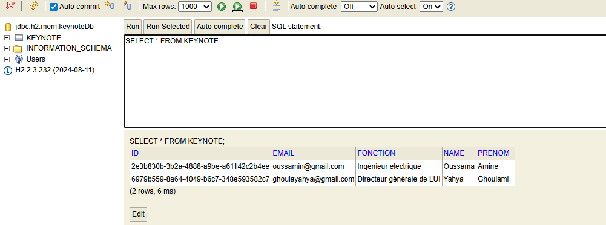 |

### C. Interface Utilisateur (Frontend Angular)

Présentation de l'application Web finale.

| Description | Capture |
| :--- | :---: |
| **9. Page d'Accueil**<br>Carousel affichant les conférences disponibles (données publiques). | 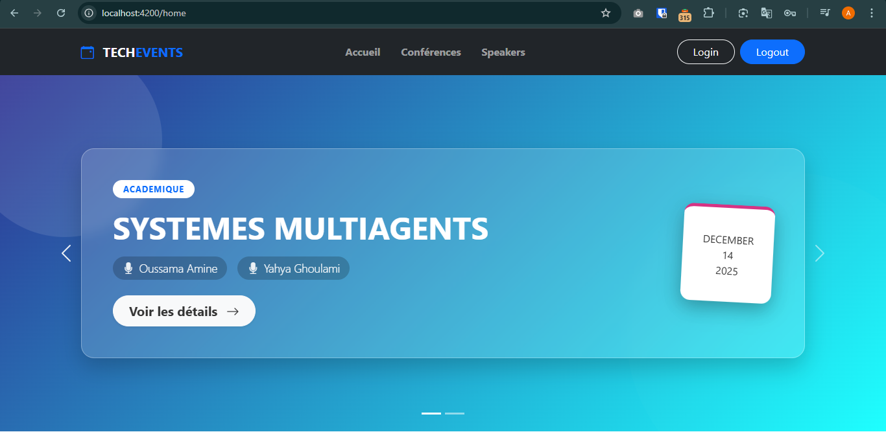 |
| **10. Authentification**<br>Redirection automatique vers Keycloak pour se connecter. | 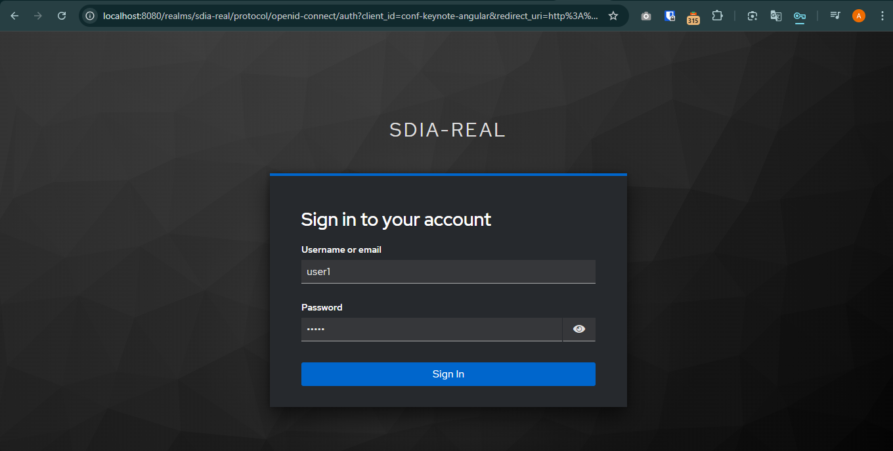 |
| **11. Liste des Conférences (Admin)**<br>Tableau de bord pour gérer les conférences (CRUD). | 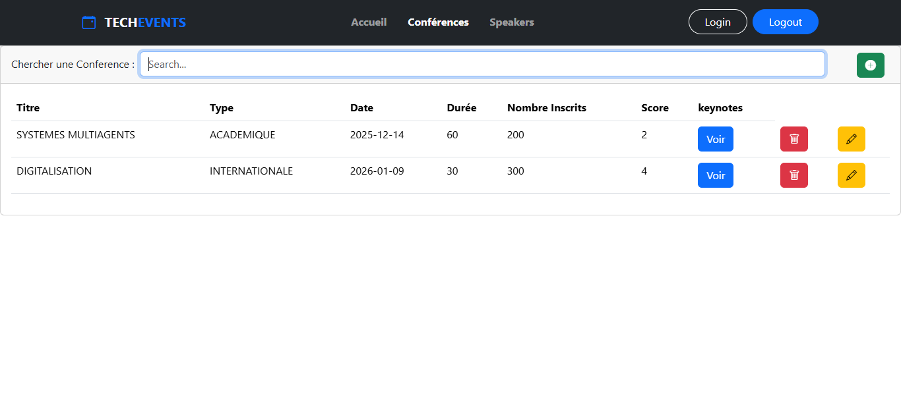 |
| **12. Gestion des Keynotes**<br>Liste des intervenants avec options de modification et suppression. | 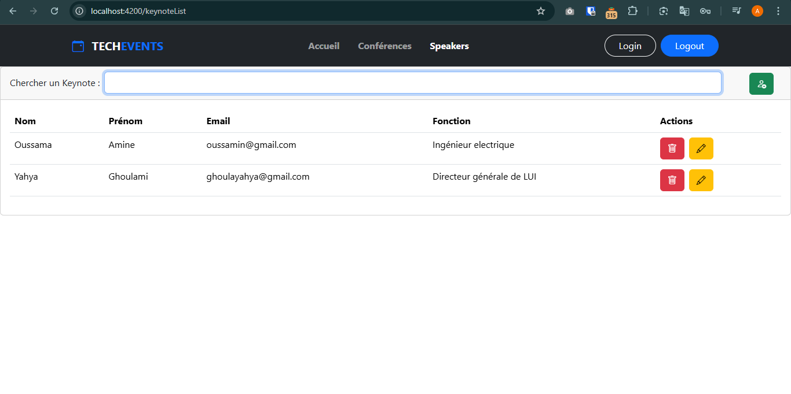 |
| **13. Ajout d'une Conférence**<br>Formulaire réactif pour créer une nouvelle conférence. | 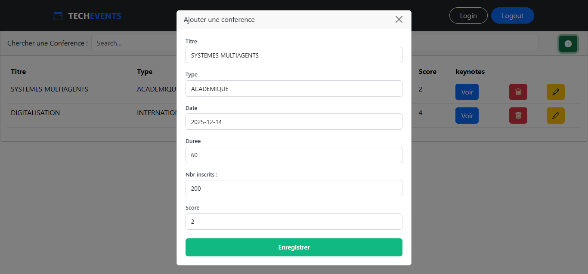 |
| **14. Association Conférence-Keynote**<br>Modal permettant d'ajouter ou retirer des speakers à une conférence (Appel inter-service via Feign). | 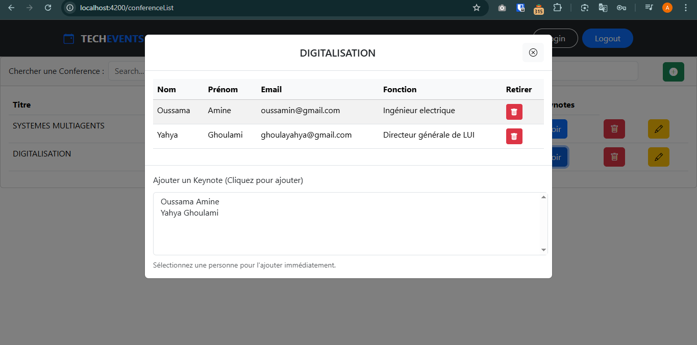 | 
